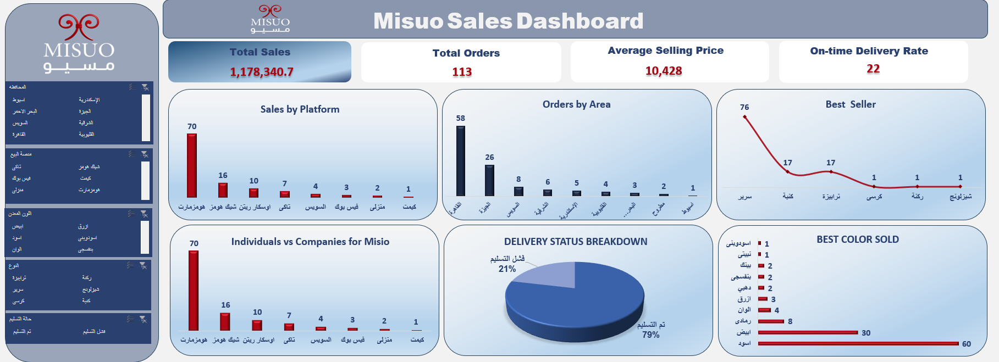

# Misuo Sales Dashboard | Excel

An interactive sales dashboard built in Microsoft Excel for **Misuo Metal Furniture Company**, designed to track sales performance, delivery status, and customer behavior to support business decision-making.

## Project Overview

This project transforms raw sales data into a clean, interactive Excel dashboard. The workflow includes cleaning and preparing the raw data, then building Pivot Tables, Pivot Charts, formulas, and interactive slicers to analyze sales performance across platforms, regions, and delivery outcomes.

## Tools & Skills Used

- Microsoft Excel
- Data Cleaning & Preparation
- Excel Formulas
- Pivot Tables & Pivot Charts
- Interactive Slicers
- Dashboard Design & Data Visualization

## Dashboard Features

**KPIs**
- Total Sales
- Total Orders
- Average Selling Price
- On-time Delivery Rate

**Visual Analysis**
- Sales by Platform
- Orders by Area
- Best Seller Analysis
- Individuals vs Companies
- Delivery Status Breakdown (On-time vs Failed)
- Best Color Sold

**Interactivity**
- Slicers for Area, Sales Platform, Metal Color, Product Type, and Delivery Status

## Key Insights

- **Homzmart** is by far the leading sales platform, generating 70 orders — more than double all other platforms combined.
- **Cairo** leads in order volume with 58 orders, followed by Giza (26) and Suez (8), showing sales are heavily concentrated in a few key areas.
- **Beds** are the best-selling product by a large margin (76 units), far ahead of the next best seller.
- On-time delivery rate stands at **79%**, while **21%** of orders faced delivery failure — a clear area for operational improvement.
- **Individual customers** drive the vast majority of sales compared to companies, with the same platform-driven pattern seen in the "Sales by Platform" chart.
- **Black (60 units) and white (30 units)** are by far the most popular colors sold, together making up the majority of total color sales.

## Repository Contents

| File | Description |
|---|---|
| `Misuo_Dashboard.png` | Screenshot preview of the dashboard |
| `README.md` | Project documentation |

## How to Use

This repository showcases the dashboard through a screenshot preview above. The Excel file itself is not included in this repository, but the images demonstrate the full functionality: KPIs, charts, and interactive slicers for filtering by area, platform, color, and delivery status.

## Author

**Shaimaa Magdy**
[LinkedIn]https://www.linkedin.com/in/shaimaa-magdy/
